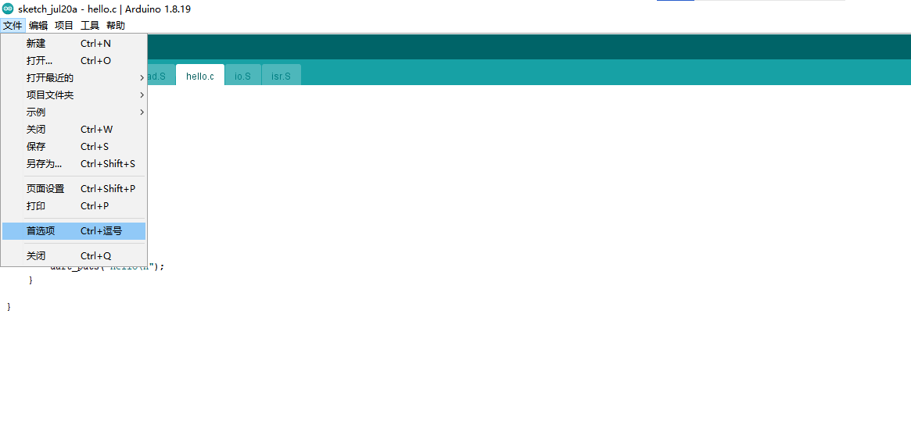
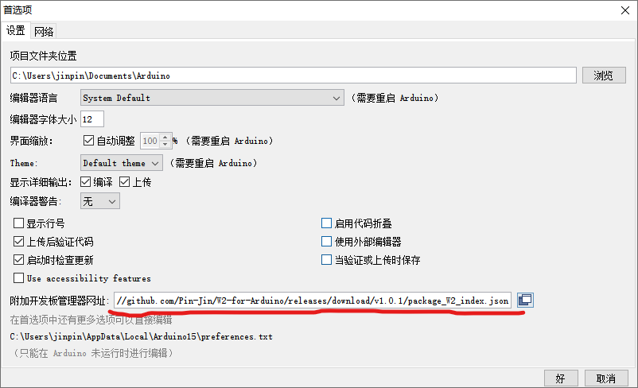
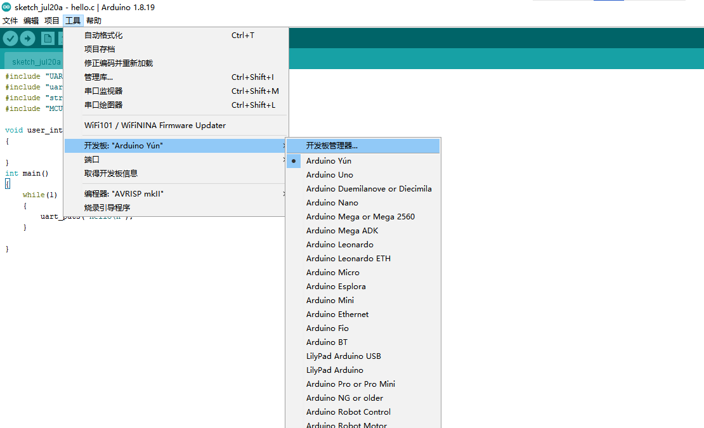
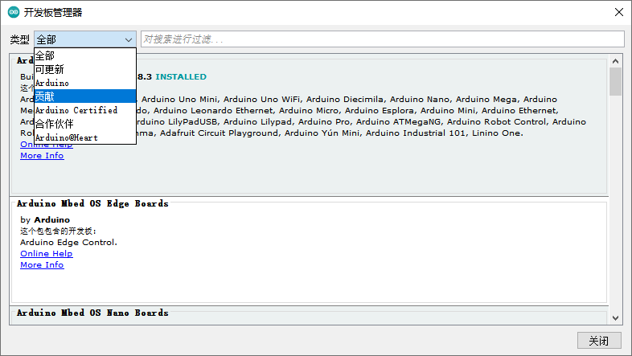
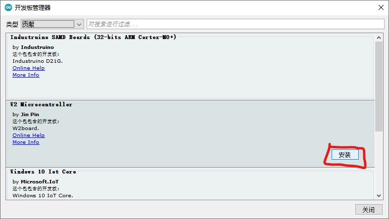

# W2-for-Arduino V1.0.1
本项目实现 Arduino IDE 对第三方板——基于 W2 芯片的开发板 的支持

目前 V1.0.1 版本可以实现在 Arduino IDE 编译项目工程，后续将不断开发：上传bin文件、支持断点调式等功能

请按照下面的步骤引导安装相应的包文件：
1. 打开 Arduino IDE，点击 **文件**-**首选项**

2. 将 https://github.com/Pin-Jin/W2-for-Arduino/releases/download/v1.0.1/package_W2_index.json 粘贴到附加开发板管理器网址，点击 **好**

3. 点击 **工具-开发板-开发板管理器**

4. 在**类型**中选择 **贡献**

5. 找到 **W2 Microcontroller**，点击安装
